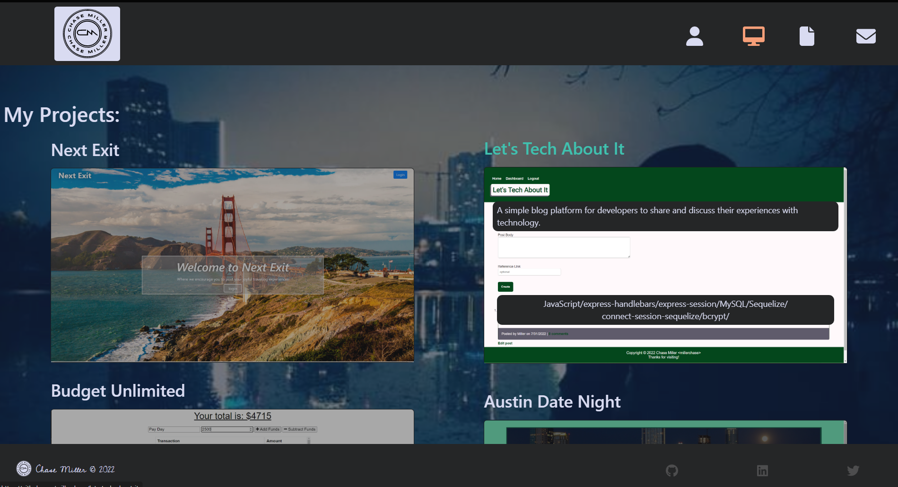
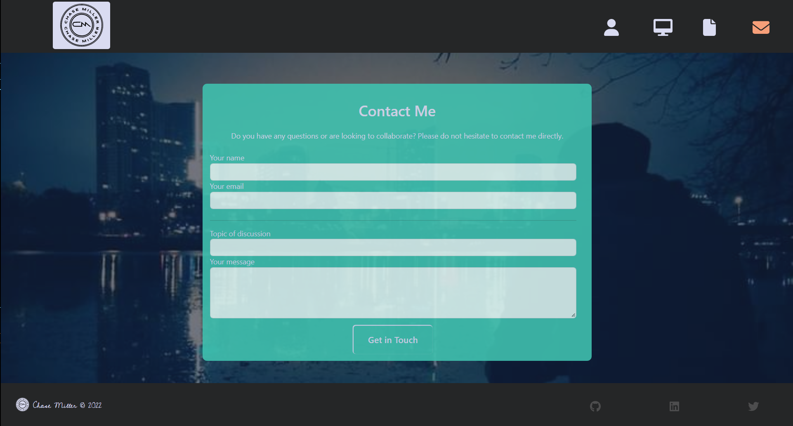

# My Portfolio

This is a Single-Page-Application built using React in order to to display my portfolio. View a few of my projects, download my resume, or get ahold of me here!

#### Deployed at: [https://millerchase.github.io/my-portfolio/](https://millerchase.github.io/my-portfolio/)

---

---

## License

Copyright &copy; 2022 Chase Miller &lt;millerchase>

Licensed under the Apache License, Version 2.0 (the "License");
you may not use this file except in compliance with the License.
You may obtain a copy of the License at

[https://opensource.org/licenses/Apache-2.0](https://opensource.org/licenses/Apache-2.0);

Unless required by applicable law or agreed to in writing, software
distributed under the License is distributed on an "AS IS" BASIS,
WITHOUT WARRANTIES OR CONDITIONS OF ANY KIND, either express or implied.
See the License for the specific language governing permissions and
limitations under the License.

## Questions

For any additional questions:

- Find me on GitHub @ [millerchase](https://github.com/millerchase)

- Or contact me directly at: mlr.chase40@gmail.com
